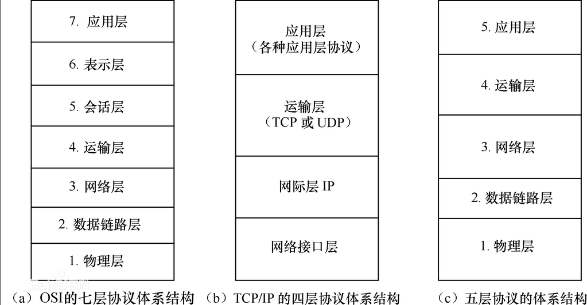
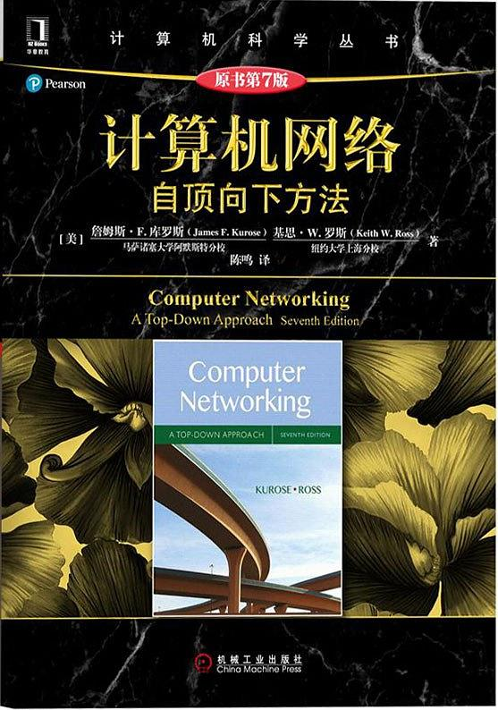

## 计算机网络

#### ☁️体系结构：

 

    
 

* 应用层（用户进程实现）
* 运输层（操作系统内核实现）
* 网络层（部分软件实现，部分硬件实现）
* 链路层（90%在网络适配器中实现，10%在CPU中实现）
* 物理层
  
  PS：

####📚参考资料:

 

      
    [计算机网络:自顶向下方法（原书第7版）](https://book.douban.com/subject/30280001/)
 

